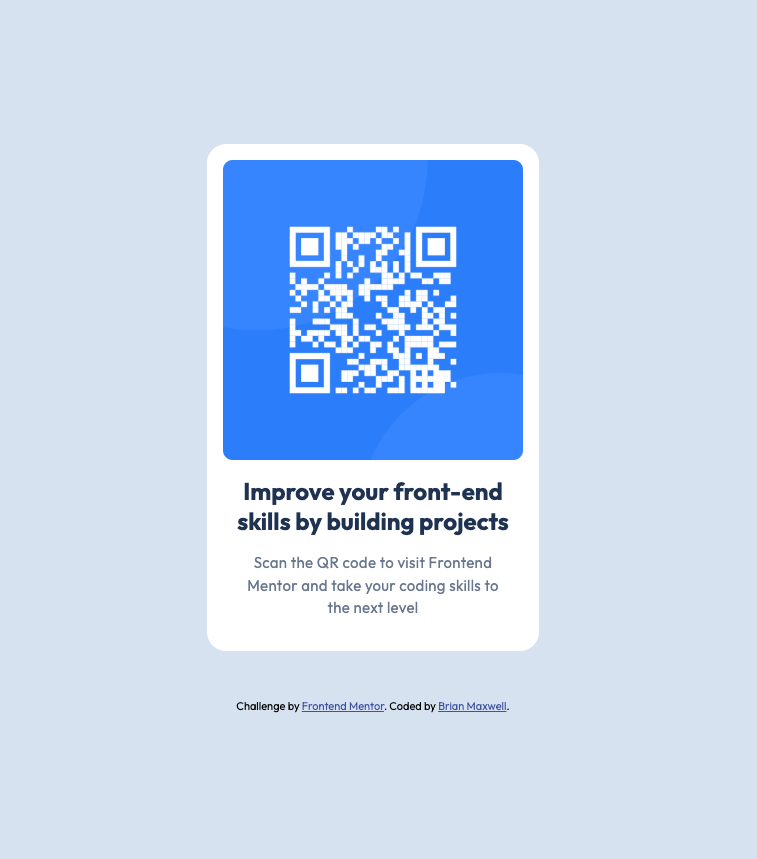

# Frontend Mentor - QR code component solution

This is a solution to the [QR code component challenge on Frontend Mentor](https://www.frontendmentor.io/challenges/qr-code-component-iux_sIO_H). Frontend Mentor challenges help you improve your coding skills by building realistic projects.

## Table of contents

- [Overview](#overview)
  - [Screenshot](#screenshot)
  - [Links](#links)
- [My process](#my-process)
  - [Built with](#built-with)
  - [What I learned](#what-i-learned)
  - [Continued development](#continued-development)
  - [Useful resources](#useful-resources)
- [Author](#author)
- [Acknowledgments](#acknowledgments)

## Overview

### Screenshot

### Links

- <a target="_blank" rel="noopener" href="../qr-code-component-main/images/desktop-design.jpg">Solution URL</a>
- <a target="-blank" rel="noopener" href="https://bamaxent.github.io/portfolio/qr-code-component-main/">Live Site URL</a>

## My process

### Built with

- Semantic HTML5 markup
- Flexbox
- Mobile-first workflow
- Handcoded custom HTML & CSS properties
- VS Code

### What I learned

That when styling elements you don't always have to you `clamp()` functions and variables, especially for a simple project like this. Simply trying to get the finish build product to look identical to design for this challenge.

### Continued development

Think more semanitcally and try to remember `flex` properties better based on `flex-position` (i.e. – `align-items` vs `justify-content`).

And `vim`. I hate `vim`. Does anyone like `vim`?

### Useful resources

- <a target="_blank" rel="noopener" href="https://vim.rtorr.com/">Vim Cheat Sheet</a>
- <a target="_blank" rel="noopener" href="https://developer.mozilla.org/en-US/">The Bible</a>

## Author

Brian Maxwell, Founder &amp; President of <a target="_blank" rel="noopener" href="https://niwebdev.com">NI Web Dev</a> 
GitHub - <a target="_blank" rel="noopener" href="https://github.com/bamaxent">@bamaxent</a>

## Acknowledgments

My boi Chat... Wouldn't be where I'm at today whithout him!

-Brian

<!-- <NI> -->
