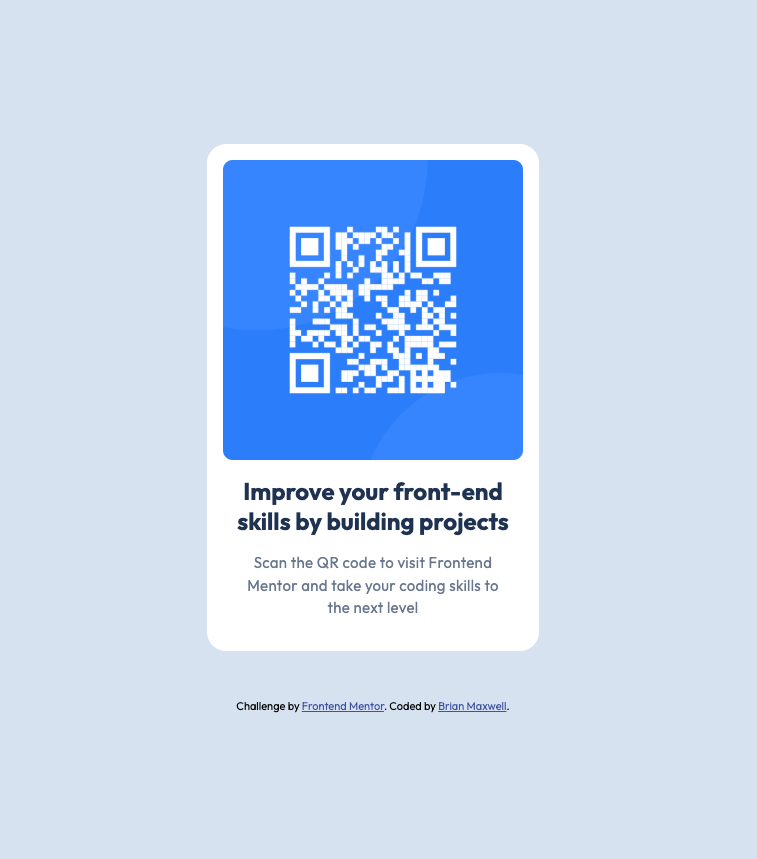

# Frontend Mentor - QR code component solution

This is a solution to the [QR code component challenge on Frontend Mentor](https://www.frontendmentor.io/challenges/qr-code-component-iux_sIO_H). Frontend Mentor challenges help you improve your coding skills by building realistic projects.

## Table of contents

- [Overview](#overview)
  - [Screenshot](#screenshot)
  - [Links](#links)
- [My process](#my-process)
  - [Built with](#built-with)
  - [What I learned](#what-i-learned)
  - [Continued development](#continued-development)
  - [Useful resources](#useful-resources)
- [Author](#author)
- [Acknowledgments](#acknowledgments)

**Note: Delete this note and update the table of contents based on what sections you keep.**

## Overview

### Screenshot

### Links

- Solution URL: [Solution Image I was trying to match](https://github.com/bamaxent/portfolio/blob/a59ce7d485e0b80869a724e2ce7446e91c6b7f8a/forntend_mentor/qr-code-component-main/design/desktop-design.jpg)
- Live Site URL: [Add live site URL here](#)

## My process

### Built with

- Semantic HTML5 markup
- Flexbox
- Mobile-first workflow
- Handcoded custom HTML & CSS properties
- VS Code

### What I learned

That when styling elements you don't always have to you `clamp()` functions and variables, especially for a simple project like this. Simply trying to get the finish build product to look identical to design for this challenge.

### Continued development

Think more semanitcally and try to remember `flex` properties better based on `flex-position` (i.e. – `align-items` vs `justify-content`).

And `vim`. I hate `vim`. Does anyone like `vim`?

### Useful resources

- [Vim Cheat Sheet](https://vim.rtorr.com/)
- [The Bible](https://developer.mozilla.org/en-US/)

## Author

Brian Maxwell, Founder &amp; President of
[NI Web Dev](https://niwebdev.com)
GitHub - [@bamaxent](https://www.frontendmentor.io/profile/yourusername)

## Acknowledgments

My boi Chat... Wouldn't be where I'm at today whithout him!

-Brian

<!-- <NI> -->
